<div align="center">

[](https://github.com/saad-r10)

</div>

---

## About Me

CS and Math student at the University of Toronto, building backend systems and developer tools. I care about reliability and clean abstractions — [Watchdog](https://github.com/saad-r10/watchdog) started as a personal itch because I kept missing outages on side projects. Fueled by coffee and Claude.

```yaml
focus:    backend · infra · reliability engineering
location: Toronto, Canada
status:   open to SWE / infra internships
```

---

## Tech Stack

**Languages**


**Infra & Cloud**


**Frameworks & Tools**


---

## Featured Projects

### [Watchdog](https://github.com/saad-r10/watchdog) &mdash; Website uptime & security monitor

Real-time alerts for downtime events, SSL certificate expiry, and misconfigured HTTP headers. Built for developers who want production-grade observability without the enterprise price tag.

### [Hobbyist](https://github.com/saad-r10/hobbyist) &mdash; Club platform prototype

Goodreads &times; Letterboxd &times; Discord, purpose-built for small groups who share books, films, or music. Front-end prototype in React demonstrating component architecture and UX design; ships with mock data.

---

## GitHub Stats

<div align="center">
  
</div>

> Stats are generated daily via GitHub Actions — image appears after the first workflow run.

---

## Connect

[](https://linkedin.com/in/saad-r10)
[](https://saad-r10.github.io/portfolio/)
[](mailto:saad.r0521@gmail.com)

---

<div align="center">
  
</div>
